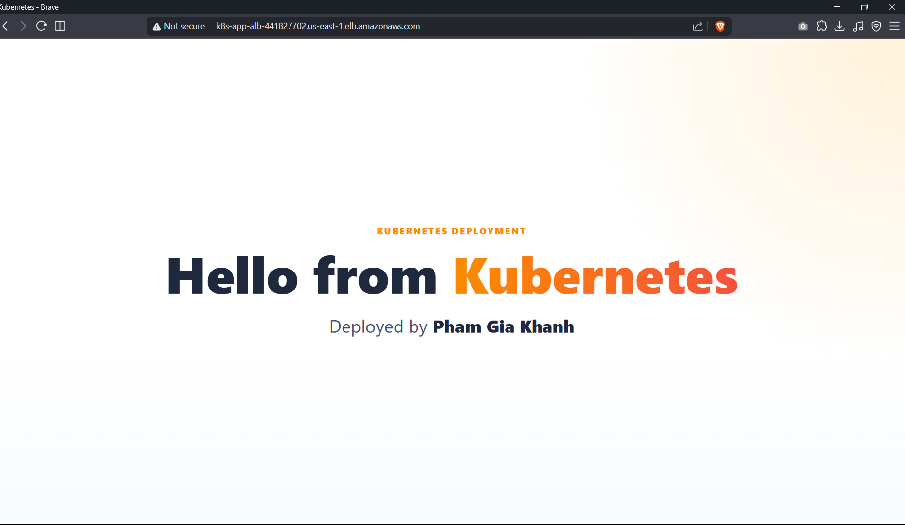
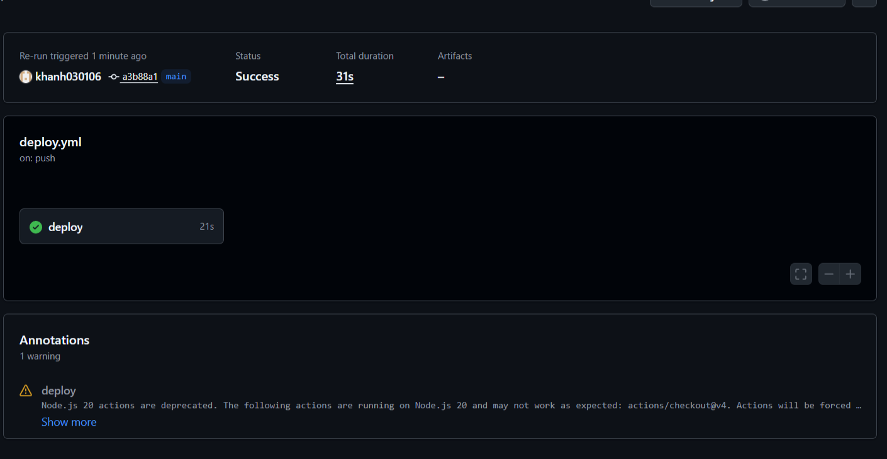
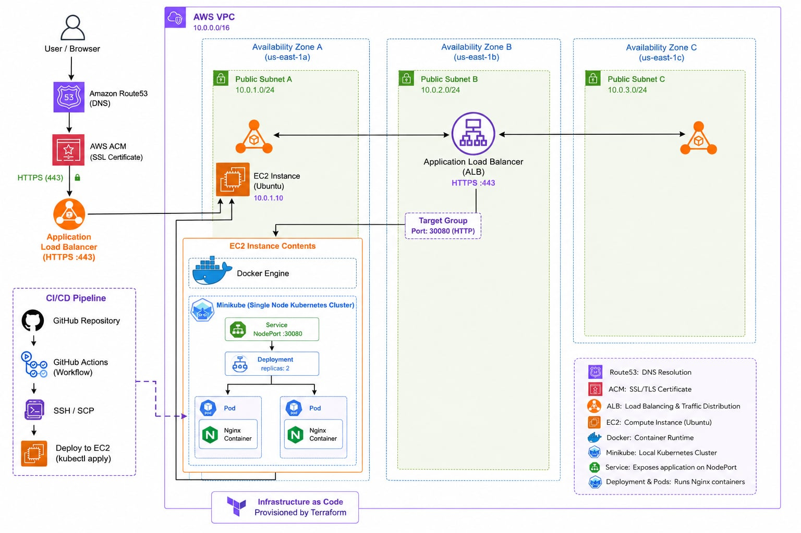

### em có bonus thêm phần CI/CD để tăng automation

# Kubernetes Deployment on AWS with Terraform

## How to Run

### 1. Clone project

```bash
git clone <YOUR_REPO_URL>
cd k8s-app
```

---

### 2. Create infrastructure with Terraform

```bash
cd Terraform

terraform init
terraform plan
terraform apply
```

Type:

```bash
yes
```

---

### 3. Get Terraform outputs

```bash
terraform output
```

Example:

```txt
ec2_public_ip = "54.xx.xx.xx"
alb_dns_name  = "k8s-app-alb-xxxx.us-east-1.elb.amazonaws.com"
```

---

### 4. Configure GitHub Actions Secrets

Go to:

```txt
GitHub Repository
→ Settings
→ Secrets and variables
→ Actions
```

Add these secrets:

```txt
EC2_HOST=<EC2_PUBLIC_IP>
EC2_USER=ubuntu
EC2_SSH_KEY=<PRIVATE_KEY_CONTENT>
```

---

### 5. Deploy application

Push code to the `main` branch:

```bash
git add .
git commit -m "deploy app"
git push origin main
```

GitHub Actions will automatically:

```txt
- copy project files to EC2
- build Docker image
- load image into Minikube
- apply Kubernetes manifests
- rollout new Pods
```

---

### 6. Access application

Open:

```txt
http://<ALB_DNS_NAME>
```

```

---

### 7. Destroy infrastructure

After testing:

```bash
terraform destroy
```

Type:

```bash
yes
```